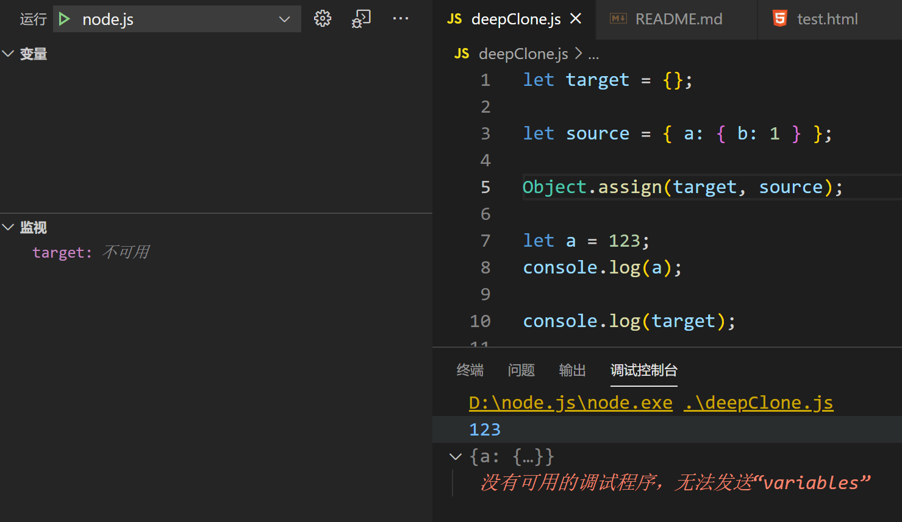

# 2021

## 一月

### vs code调试报“没有调试适配器，无法发送“variables"



今天在vs code调试node.js时打印输出一个对象结果时，点开打印内容，提示如上，并看不到打印内容。

原因及解决方法：

出现在这种情况是因为node调试比较特殊，执行调试完成之后进程退出，这时候去看它的打印内容就看不到了

需要看到他具体的值，在打印的地方加上**断点**即可


### Value below was evaluated just now

在`Vue`项目中，发现页面没有获取到数据展示

在浏览器控制台中打印为 `{}`，但是点击展开会有数据，非常奇怪

仔细看，控制台打印比正常多了一个提示

```
value below was evaluated just now
```

经查阅得知

其实是在`Chrome Console.log()`点击展开数组时

会**重新**去读一遍内存**真实的值**然后显示

所以，在打印时，其实如若**不展开**，他显示的就**是当前值**，但是点击**展开后**，会**重新去内存读值**，所以展开的值，是**最终值**


**相关文章**

- [记一次"Value below was evaluated just now"](https://segmentfault.com/a/1190000018831992)

- [一个“诡异”的console.log()结果](https://segmentfault.com/a/1190000012457905)

> 调试时不用过于相信console.log，基本数据类型的打印是不会有什么问题的，但是对于对象可靠的方法是通过打断点的方式去看


### 一篇文章牵扯出来的一系列知识点

- 深拷贝与浅拷贝

- WeakMap和Map的区别，他的真正作用是什么
- 对象的循环引用问题，如何解决，一般什么时候会发生
- JS中引用计数垃圾回收策略的问题（JS的垃圾回收机制）
- 什么是弱引用
- Reflect.ownKeys()与Object.keys()的区别
- Object各个属性方法的使用
- 原型链继承


